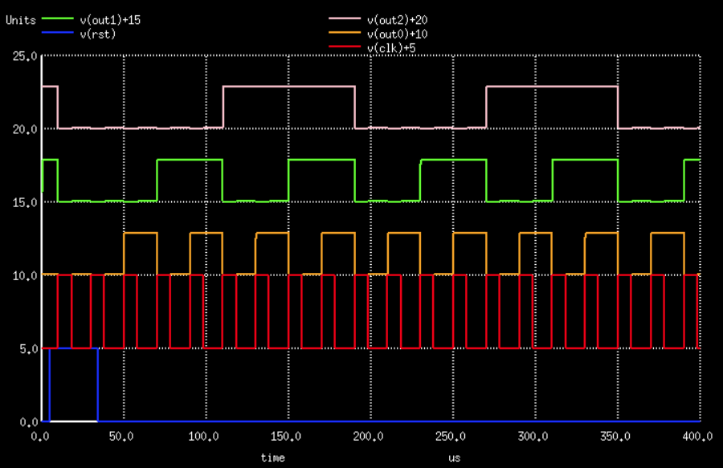

+++
title = "VHDL/Verilog to Discrete Logic Flow"
summary = "Work in progress: Flow to synthesize VHDL/Verilog code into a PCB"
date = "2021-07-18T00:00:00"
draft = false
hackaday_url = "https://hackaday.io/project/180839-vhdlverilog-to-discrete-logic-flow"
featured = "featured.png"
showHero = true
heroStyle = "background"
layoutBackgroundBlur = false
+++
*Work in progress: Flow to synthesize VHDL/Verilog code into a PCB*

## Details

# The Flow Architecture


Github repository: [https://github.com/cpldcpu/PCBFlow](https://github.com/cpldcpu/PCBFlow)

[https://github.com/cpldcpu/PCBFlow](https://github.com/cpldcpu/PCBFlow)

## Project Logs
### 1) Goal Setting
<small>2021-10-04 19:50</small>

As stated in the introduction, the goal of this project is to create a workflow to generate a PCB with discrete (transistor based) logic from a hardware description language file. This should happen in a reproducible and automated way, with as little user interaction as possible.


Let's get one thing out of the way first, the inevitable question of "why"? Some possible reasons:

- I'd like to use this as an opportunity to tinker with open source electronic design automation (EDA) flows and learn more about their inner workings.
- The availability of low cost PCB manufacturing and assembly services had the side effect of allowing manufacturing of complicated discrete logic circuits for little money. Nothing more satisfying than to get actual hardware from your design.
- More and more open source EDA tools are becoming available, providing a solid foundation to build on.
- Because I (possibly) can! Well...

To be a bit more specific about the goals:

- The source language should be VHDL, because that is what I am used to. Verilog is a close second, in case there is no other choice.
- The target logic family should be resistor transistor logic (RTL). The reason for that is that the MMBT3904, a bipolar NPN transistor, is currently the cheapest transistor at the JLCPCB assembly service. I may also look into NMOS logic.
- As a first step, the main goal should be to get a functional circuit that implements the HDL input. It is acceptable to compromise on performance. For example, timing analysis, clock tree insertion and power routing can all be introduced or optimized at a later time.

### 2) Existing Tools to build on
<small>2021-10-06 08:02</small>

Automatic synthesis of digital circuits has been the domain of very expensive electronic design automation tools in the past decades. Since a few years, there seems to be considerable momentum to develop and make available free toolchains for ASICs and FPGAs.

#### Notable projects

[Yosys](https://github.com/YosysHQ)

Yosys is probably the project that started the renewed momentum in free EDA tools. Is a versatile framework for logic synthesis and initially targeted a verilog to FPGA flow with a backend specific to lattice FPGAs. In the mean time this has been extended to [SymbiFlow](https://github.com/SymbiFlow) an open source toolchain supporting many FPGAs. [ghdl-yosys-plugin](https://github.com/ghdl/ghdl-yosys-plugin) is a plugin based on [GHDL](https://github.com/ghdl/ghdl) that brings VHDL support to Yosys. (So I can achieve my goal of being able to use VHDL).

[Verilog to Routing](https://verilogtorouting.org/)

Is a verilog to FPGA toolchain with a freely configurable backend allowing to explore different FPGA architectures, which is in contrast to Yosys which is somewhat hardcoded for specfic FPGA architectures. It is based on a different logic synthesis tool, Odin II.

I pondered for a while whether it was possible to adapt a FPGA toolchain to create PCB based designs. The idea would be to provide a matrix of fixed functional elements and let the toolchain do the  routing. Unused elements could be removed later. In the end I did not pursue this route since the toolchains are heavily geared towards working with larger functional elements (e.g. LUTs), which cannot be easily implemented in discrete logic on a PCB.

[qflow](http://opencircuitdesign.com/qflow/index.html)

Qflow is an open source synthesis flow targeting integrated circuits, that combines several preexisting tools to a full workflow. It is available from [http://opencircuitdesign.com/](http://opencircuitdesign.com/). Yosys or Odin II is used  for synthesis, Greywolf for placement and routing, qrouter for routing.

[The-OpenROAD-Project](https://github.com/The-OpenROAD-Project/OpenLane)

The OpenLane flow is another digital design flow that picked up a lot of momentum and sees a lot of activity. It uses Yosys as the synthesis frontend and a newley developed tools, OpenROAD app, for placement and routing. The flow supports the [/skywater-pdk](https://github.com/google/skywater-pdk), an open process development kit for a 130 nm CMOS process.

Lists of open source EDA tools:

[open-source-cad-tools](http://www.vlsiacademy.org/open-source-cad-tools.html)
[eda-collection](https://github.com/pkuzjx/eda-collection)

#### Adopting an ASIC flow?

The problem of synthesizing digital logic for a PCB is actually very simular to synthesizing logic for an integrated circuit.


The image above shows the architecture of the OpenLane Flow (taken from [here](https://github.com/The-OpenROAD-Project/OpenLane#openlane-architecture)). The input to the flow is a our design file and a description of the technology, the PDK. At each step in the flow, the design is transformed in some way and saved in an internal representation until finally a layout file is generated. There are some feedback loops were tools parameters have to be finetuned to optimize the result.

Let's go through it step-by-step. Normal text is the OpenLane flow, italics are my thoughts.

- **Synthesis**
  1. `yosys` - Performs RTL synthesis
  2. `abc` - Performs technology mapping
  3. `OpenSTA` - Performs static timing analysis on the resulting netlist to generate timing reports

*This step takes the Verilog/VHDL source and turns it into a list of logic gates. The critical step here will be to define a set of logic gates that can be implemented in discrete logic and convince the tool to map to only these gates. Timing analysis is a step we will skip for now as the focus should be to get a functional circuit at first. Improvement of maximum clock speed could be a later optimization.*

- **Floorplan and PDN**
  1. `init_fp` - Defines the core area for the macro as well as the rows (used for placement) and the tracks (used for routing)
  2. `ioplacer` - Places the macro input and output ports
  3. `pdn` - Generates the power distribution network
  4. `tapcell` - Inserts welltap and decap cells in the floorplan

*The floorplan prepares the area where the synthesized logic goes and creates the power network. As a first step I will treat the power network as a normal net, which should be acceptable if performance is not a goal. A big question is wether the tools can be repurposed resued in any way.*

- **Placement**
  1. `RePLace` - Performs global placement
  2. `Resizer` - Performs optional optimizations on the design
  3. `OpenDP` - Perfroms detailed placement to legalize the globally placed components

*Places the predefined logic cells in a grid into the predesignated area on the IC. A critical step is to optimize the arrangement of the logic cells to minimize the length of interconnecting wired needed. We would have to do the same for the PCB and write the component footprints and placements. For our PCB flow, the output of this step should be an unrouted PCB.*

- **CTS**
  1. `TritonCTS` - Synthesizes the clock distribution network (the clock tree)

*Optimized timing of the clock destribution network. For the PCB based flow we can treat the clock network as any other in a first step. This will only work if we can make sure that we have logic that cannot create unwanted conditions as a results of different timing. The easiest way to ensure this is to use D-flipflops.*

- **Routing**
  1. `FastRoute` - Performs global routing to generate a guide file for the detailed router
  2. `CU-GR` - Another option for performing global routing.
  3. `TritonRoute` - Performs detailed routing
  4. `SPEF-Extractor` - Performs SPEF extraction

*Routing of interconnects. Tools for ICs typically rely on many routing layers and detailed rules to optmize the routing. Since there are already many autorouters available for PCBs, the first step would be to use an existing tool.*

- **GDSII Generation**
  1. `Magic` - Streams out the final GDSII layout file from the routed def
  2. `Klayout` - Streams out the final GDSII layout file from the routed def as a back-up

*This step is akin to generating the Gerber files for PCB manufacturing. There are many tools available for PCBs, so this should be solveable.*

- **Checks**
  1. `Magic` - Performs DRC Checks & Antenna Checks
  2. `Klayout` - Performs DRC Checks
  3. `Netgen` - Performs LVS Checks
  4. `CVC` - Performs Circuit Validity Checks

*Design rules checks are also available for PCBs, so we can rely on existing tool.*

### 3) The Flow
<small>2021-10-13 23:14</small>

To cut a (quite) long story short, you can see the flow I came up with below.


The diagram above shows how the individual steps of the flow are connected. The starting point is the design (A VHDL source file) in the blue file box. In subsequent steps, this design will be transformed by various tools into new intermediate representations (grey). To aid this, technology description files and testbenches are needed (orange). The output at the end of the flow are the three green files, which describe the PCB layout (Gerber), the part list (BOM) and where the parts have to be placed on the PCB (Pick & Place).

Right now, everything is based on shell scripts that have to be invoked manually and sub-sequentially. The numbers in the process boxes indicate the number of the script that performs this step. Scripts ending on zero (10,20,30) are mandatory steps for the flow, scripts ending on other digits are optional, e.g. for intermediate simulation.

The output of the automated part of the flow is an unrouted PCB. Routing and design file generation has to be invoked manually with the indicated tools.

You can find the current state of affairs on Github.

##### [https://github.com/cpldcpu/PCBFlow](https://github.com/cpldcpu/PCBFlow)

The technology description files and scripts reside in subfolders. Subfolder 10 also holds the design files.

Please be aware that the placement tool is in a very early experimental stage. Constants in the code may have to be tuned for better results depending on input design.

All intermediate and output files are stored in the work folder. It can be cleaned by calling the "clean_all.sh" script.

I am planning to follow up with some addtional logs explaining how I arrived at the current state, to show some examples and to document future changes.

### 4) Digital Simulation
<small>2021-11-03 19:02</small>

Digital simulation is quite straightforward. GHDL is well established here. I implemented a simple counter in VHDL to use an example for flow development. The source code is shown in the figure below and simulation traces from the testbench at the bottom of the page.

I implemented this part of the flow based on a standard Makefile. I switched to normal bash scripts for later parts because it became difficult to track built dependencies across folders. I may have to look into Tcl/Tk or other solutions at some point.

```ruby
entity counterx is
    port (clk:  in  std_logic;
          rst:  in  std_logic;
          count: out std_logic_vector(2 downto 0)
    );
end;

architecture main of counterx is
    signal  cnt:    unsigned(2 downto 0);
begin

    process (clk,rst)
    begin
        if rising_edge(clk) then
            if (rst = '1') then
                cnt <= (others => '0');
            else
                cnt <= cnt + 1;
            end if;                
         end if;
    end process;

    count <= std_logic_vector(cnt);     
end;
```


### 5) Synthesis and Technology Mapping
<small>2021-11-03 19:04</small>

This is where things get a bit more interesting. I was concerned that it was quite difficult to coerce Yosys into using my custom gate libraries, but in fact it was rather easy.

The "cmos" example proved to be an excellent blueprint to creating a custom library. My logic family of choice is Resistor-Transistor-Logic (RTL), which is based only on resistors and transistors. Coincidentally, this is the same logic family that is used in the famous [CDC6600 supercompute](https://cpldcpu.wordpress.com/2020/02/14/what-made-the-cdc6600-fast/)r. The basic logic element of RT-Logic is a NOR gate. Hence our design has to be implemented using inverters and NOR gates only. In addition, a storage element, a D-Flipflop, is needed.

Description of the logic cell has to be provided in the [Liberty format](https://media.c3d2.de/mgoblin_media/media_entries/659/Liberty_User_Guides_and_Reference_Manual_Suite_Version_2017.06.pdf). This format is quite comprehensive and usually also  contains information about timing, area and wire loading. Luckily this information can simply be omitted which allows the library to be rather short and simple. The listing below shows the description of a NOR2 cell and a D-FF. The area line holds the number of transistors that are being used in this particular cell, hence the optimizer will try to reduce the number of transistors in the circuit. (In a real IC you don't care about the number of transistors, but mostly silicon area. For a discrete circuit on a PCB the number of transistors is more relevant)

You will notice that the DFF requires a whopping 15 transistors. This is indeed the minimum number of transistors for a "clean" DFF, as you will see later. There are some options to reduce this down to 7-8.

```bash
library(SingleLogicCells) {
  cell(NOR2) {
    area: 2;
    pin(A) { direction: input; }
    pin(B) { direction: input; }
    pin(Y) { direction: output;
             function: "(A+B)'"; }
  }

  cell(DFF) {
    area: 15;
    ff(IQ, IQN) { clocked_on: C;
                  next_state: D; }
    pin(C) { direction: input;
                 clock: true; }
    pin(D) { direction: input; }
    pin(Q) { direction: output;
              function: "IQ"; }
  }
}

```

The listing below show the yosys script to elaborate the design, perform technology mapping and optimization. Some intermediate output is generated as PDF file. The final output is stored in spice format, which turned out to be the easiest one to import to my placement tool.

```text

# VHDL to Discrete logic

# elaborate VHDL code from GHDL
ghdl
hierarchy -check

# Rename top entity to 'main'. This is important, otherwise other parts of the flow may break.
rename -top main

# Draw netlist of elaborated design
show -format pdf -prefix 200_diagramm_hdl_elaborated

# Insert tristate buffers (ATTENTION: Currently not a supported cell type during P&R)
tribuf

# Technology mapping
techmap

proc; opt; fsm; opt; 
dfflibmap -liberty ../20_SYNTH/discrete_logic_liberty.lib
abc -liberty ../20_SYNTH/discrete_logic_liberty.lib
opt_clean

# Print Statistics
stat -liberty ../20_SYNTH/discrete_logic_liberty.lib

# Draw netlist of optimized and mapped design
show -format pdf -prefix 208_diagramm_after_mapping

# Write out in spice format
write_spice 209_synthesized_output.sp
```

The counter design directly after elaboration.


The counter design after technology mapping. All high level logic block have been broken down into simple gates.


Finally, statistics of the design after the complete synthesis step.  13 logic cells have been generated, comprising a total number of 65 transistors.

```javascript
13. Printing statistics.

=== main ===

   Number of wires:                 14
   Number of wire bits:             18
   Number of public wires:           4
   Number of public wire bits:       8
   Number of memories:               0
   Number of memory bits:            0
   Number of processes:              0
   Number of cells:                 13
     DFF                             3
     NOR2                            4
     NOR3                            3
     NOT                             3

   Chip area for module '\main': 65.000000
```

The spice output is relatively easy to read. Each of the "X..." lines corresponts to one logic cell including net names and cell type. As an extra quirk, voltage sources with "0V" are used to connect different nets.

```css
* SPICE netlist generated by Yosys 
.SUBCKT main clk rst count.0 count.1 count.2
X0 cnt.0 1 NOT
X1 cnt.1 2 NOT
X2 cnt.2 3 NOT
X3 rst cnt.0 4 NOR2
X4 1 2 5 NOR2
X5 cnt.2 5 6 NOR2
X6 1 2 3 7 NOR3
X7 rst 6 7 8 NOR3
X8 cnt.0 cnt.1 9 NOR2
X9 rst 5 9 10 NOR3
X10 clk 8 cnt.2 DFF
X11 clk 4 cnt.0 DFF
X12 clk 10 cnt.1 DFF
V0 cnt.0 count.0 DC 0
V1 cnt.1 count.1 DC 0
V2 cnt.2 count.2 DC 0
.ENDS main

************************
* end of SPICE netlist *
************************

```

### 6) Logic Implementation and Analog Simulation
<small>2021-11-03 20:32</small>

#### Basic logic gate implementation

The synthesis step transforms the digital circuit into a spice netlist based on logic cells. To complete the circuit and allow analog simulation we have to actually implement the logic on devices level.

The most basic element of resistor-transistor-logic is an inverter. Logic levels are defined by the ratio between Rbase, Rload and the fanout, the number of gates connected to the output. To attain constant logic levels, it is therefore necessary to adjust the load resistor according to the fanout.


To work around this added complexity, I used a small trick, as shown below. The load resistor is moved to the input of the gate and the output is now "open collector".


This has two advantages:

1. The logic levels are now independent of fanout, because the effective load resistance of the net will be reduced in proportion to the number of gates connected to it.
2. Creating of NOR gates is possible by connecting the output of multiple inverters, without affecting the logic levels.

The only caveat is that an additional resistor has to be connected to the output of the circuit, if it is not connected to the input of another gate. For example if a TTL gate is connected.

Below you can see the spice implementation of the basic inverter (NOT-Gates) and NOR2, NOR3 gates directly formed from it. This concept is extremely elegant, since our entire logic circuit can be implemented from a single basic element. Avoiding irregularity simplifies later steps like placement and routing.

```text

.SUBCKT NOT A Y
Q1 Y N001 VEE 0 RTL_NPN
R1 VCC A {RL}
R2 N001 A {RB}
.ENDS NOT

.SUBCKT NOR2 A B Y
X1 A Y NOT
X2 B Y NOT
.ENDS NOR2

.SUBCKT NOR3 A B C Y
X1 A Y NOT
X2 B Y NOT
X3 C Y NOT
.ENDS NOR2
```

#### 

#### Latches and Flip Flops

HDL designs are typically based on registers, not latches. Hence a D-Flipflop is needed as a basic element. A D-Flipflop can be formed from two latches and an additional inverter for clock inversion.

To stay consistent with the logic family and reduced the number of transistors, I am using a polarity-hold latch as shown below.


The function of the inverter X4 is to invert the clock. In principle, it could be shared beteween several DFF. However, the delay induced by the inverter is crucial to prevent an invalid state that casuses data corruption, therefore I opted to keep the inverter separate for each DFF. (See [Earle Latch](https://en.wikipedia.org/wiki/Flip-flop_(electronics)#Earle_latch))

One nasty habit of the polarity hold latch is to introduce a glitch in the output for a rising clock edge when the output is zero. See spice simulation of a single PH-Latch below. Additional transistors can be spent to remove this behavior. Curiously this was also present in the CDC6600 (See [thornton book](https://archive.computerhistory.org/resources/text/CDC/cdc.6600.thornton.design_of_a_computer_the_control_data_6600.1970.102630394.pdf)).


The spice netlist for the polarity hold latch and a D-FF formed from two PH-Latches is shown below.

```css
.SUBCKT DLATCH E D Q
X1 D nE N001 NOR2
X2 E Q nQ NOR2
X3 N001 nQ Q NOR2
X4 E nE NOT
.ENDS DLATCH

.SUBCKT DFF C D Q
X1 nC D t DLATCH
X2 C t Q DLATCH
X3 C nC NOT
.ENDS DFF
```

#### 

#### Testbench

Analog spice simulation can be perfomed using NgSpice. The testbench is shown below, it is directly based on the "cmos" example in Yosys. In addition to the logic cell library it also includes a transistor model.

```php
* Spice testbench for discrete logic counterx
* Bases on Yosys "CMOS" example

* supply voltages
.global Vee Vcc
Vee Vee 0 DC 0
Vcc Vcc 0 DC 5

* load design and library
.include ../20_SYNTH/discrete_logic_spice_subckt.lib
.include ../20_SYNTH/RTL_NPN.lib
.include 209_synthesized_output.sp

* Define base and load resistor
.param RL=4.7k
.param RB=4.7k

* input signals

Vclk clk 0 PULSE(0 5 10u 20n 20n 8u 20u)
Vrst rst 0 PULSE(0 5 5u 20n 20n 29u 400u)

* Note: No pull up needed on outputs since they are internally connected. B
* Pull ups may have to be added for other designs

Xuut clk rst out0 out1 out2 main

.tran 20n 400u

.control
run
plot v(clk)+5 v(rst) v(out0)+10 v(out1)+15 v(out2)+20 
.endc

.end
```

Simulation output is shown below. One can clearly see how the three bit counter counts up. In addition, the spikes caused by the polarity hold latch are visible.


### 7) Placement - PCBPlace.py
<small>2021-11-05 21:37</small>

Finally coming to the tricky part - the placement. The purpose of the placement step is to assign physical locations on the PCB to every unit cell that was generated during synthesis. Cells cannot just be placed randomly, their placement has to be optimized according to various creteria.

I spent a lot of time looking into freely available placement tools for integrated circuits. Unfortunately none of them seemed suitable for adoption to a PCB based flow. In the end I decided to write my own simple tool based on Python. Certainly not the best choice when it comes to speed, but a huge time-saver for  handling complex datastructures and filetypes. The execution times are still acceptable, since typical design sizes for the PCB-Flow are rather small.

The placement starts by parsing the spice netlist generated by Yosys and breaking down all complex cells into simpler cells consisting of a single transistor and a few resistors - typically NOT cells, as indicated before. As a starting point, these are placed in a rectangular grid. I/O pins are detected, placed in row 0 and marked as immovable objects. Along with each cells location also the net names are saved.

```cpp
X       0      1      2      3      4      5      6
Y
0      IO     IO     IO     IO     IO     IO     IO
1     NOT    NOT    NOT    NOT    NOT    NOT    NOT
2     NOT    NOT    NOT    NOT    NOT    NOT    NOT
3     NOT    NOT    NOT    NOT    NOT    NOT    NOT
4     NOT    NOT    NOT    NOT    NOT    NOT    NOT
5     NOT    NOT    NOT    NOT    NOT    NOT    NOT
6     NOT    NOT    NOT    NOT    NOT    NOT    NOT
7     NOT    NOT    NOT    NOT    NOT    NOT    NOT
8     NOT    NOT    NOT    NOT    NOT    NOT    NOT
9     NOT    NOT    NOT    NOT    NOT    NOT    NOT
10    NOT    NOT  EMPTY  EMPTY  EMPTY  EMPTY  EMPTY
11  EMPTY  EMPTY  EMPTY  EMPTY  EMPTY  EMPTY  EMPTY
12  EMPTY  EMPTY  EMPTY  EMPTY  EMPTY  EMPTY  EMPTY
13  EMPTY  EMPTY  EMPTY  EMPTY  EMPTY  EMPTY  EMPTY
14  EMPTY  EMPTY  EMPTY  EMPTY  EMPTY  EMPTY  EMPTY
15  EMPTY  EMPTY  EMPTY  EMPTY  EMPTY  EMPTY  EMPTY
Initial length: 369
```

The figure above shows an example for the initial placement of cells for the counter example. In addition to the placement also the main optimization criterium is calculated, the total net length. The optimization algorithm tries to minimize the sum of all interconnections between the cells. There are also other parameters that need to be optimized for (e.g. routing channel congestion, power nets, clock nets, timing), but as a first step the net length is a sufficient criteriam.

After initial placement, the grid is optimized using a [simulated annealing](https://en.wikipedia.org/wiki/Simulated_annealing) algorithm. The algorithm is based on picking two cells at random, and swapping them when certain critera are met. The criterium when these swaps are allowed is based on a "temperature" parameter. The temperature is initially high. At this stage also cells that lead to an increase in netlength can be swapped. The temperature is gradually reduced during the optimization process, until only swaps that actually reduce total net length are allowed.

This method is relatively easy to implement and quite effective. The main challenge was implement the algorithm in a way where the netlength is only relatively updated during cell swaps. Anything else would have increased the computation time significantly.

The figure below shows the progress of 100 x 50000 optimization steps in a more complex design (top row is netlength, bottom row is temperatere).  You can see that some increase of netlength takes place while the temperature is high. This is expected behavior and shows that the algorithm works as intended.


Since simulated annealing is prone get stuck in local optima, initial optimization is attempted on 20 candidates with different random seeds and detailed optimization is performed only on the best candidate. There are certainly many ways to improve the optimization further, but for now it is good enough. Run time is 1-10 minutes, depending on design size.

Optimized cell placement for the counter example is shown below.

```cs
Final length: 163
X       0      1      2      3      4      5      6
Y
0      IO     IO     IO     IO     IO     IO     IO
1   EMPTY  EMPTY  EMPTY  EMPTY    NOT    NOT  EMPTY
2   EMPTY  EMPTY    NOT  EMPTY    NOT    NOT  EMPTY
3   EMPTY    NOT    NOT  EMPTY    NOT    NOT  EMPTY
4   EMPTY    NOT    NOT    NOT    NOT    NOT  EMPTY
5   EMPTY    NOT    NOT    NOT    NOT    NOT  EMPTY
6     NOT    NOT    NOT    NOT    NOT    NOT    NOT
7     NOT    NOT    NOT    NOT    NOT    NOT    NOT
8     NOT    NOT    NOT    NOT    NOT    NOT    NOT
9   EMPTY    NOT    NOT    NOT    NOT    NOT    NOT
10  EMPTY  EMPTY    NOT    NOT    NOT    NOT    NOT
11  EMPTY  EMPTY    NOT    NOT    NOT    NOT    NOT
12  EMPTY  EMPTY  EMPTY    NOT    NOT    NOT    NOT
13  EMPTY  EMPTY  EMPTY    NOT    NOT    NOT  EMPTY
14  EMPTY  EMPTY  EMPTY  EMPTY    NOT    NOT  EMPTY
15  EMPTY  EMPTY  EMPTY  EMPTY  EMPTY  EMPTY  EMPTY
```

Due to the way the optimization criteria are defined, the cells tend to gravitate toward a common center of mass.

```cs
X                  0                  1                   2                   3                   4                   5                  6
Y
0              [VCC]              [clk]               [rst]           [count.0]           [count.1]           [count.2]              [GND]
1                 []                 []                  []                  []  [count.1, X12bX2o]  [X10bX2o, count.2]                 []
2                 []                 []  [count.0, X11bX2o]                  []  [X12bX2o, count.1]      [clk, X10bX2o]                 []
3                 []      [clk, X11bCI]  [X11bX2o, count.0]                  []      [clk, X12bX2o]  [count.2, X10bX2o]                 []
4                 []  [X11bCI, X11bX1o]      [clk, X11bX2o]  [X12bX1o, count.1]    [X12DI, X12aX2o]    [X12aX2o, X12DI]                 []
5                 []   [X11DI, X11bX1o]  [X11bX1o, count.0]   [X12bCI, X12bX1o]    [X12DI, X12bX1o]    [X12CI, X12aX2o]                 []
6   [X11DI, X11aX2o]   [X11aX1o, X11DI]        [count.0, 4]       [clk, X12bCI]    [X12aX1o, X12DI]        [clk, X12CI]   [X10aX2o, X10DI]
7   [X11aX2o, X11DI]  [X11aCI, X11aX1o]        [4, X11aX1o]        [count.0, 9]   [X12aCI, X12aX1o]     [X12CI, X12aCI]   [X10DI, X10aX2o]
8   [X11CI, X11aX2o]    [X11CI, X11aCI]            [rst, 4]        [count.1, 9]       [10, X12aX1o]        [clk, X10CI]   [X10CI, X10aX2o]
9                 []       [clk, X11CI]        [count.0, 1]             [9, 10]        [count.1, 2]       [clk, X10bCI]    [X10CI, X10aCI]
10                []                 []              [1, 7]           [rst, 10]              [2, 7]   [X10bCI, X10bX1o]  [X10aCI, X10aX1o]
11                []                 []              [1, 5]             [5, 10]              [2, 5]    [X10DI, X10bX1o]   [X10aX1o, X10DI]
12                []                 []                  []            [rst, 8]              [5, 6]  [X10bX1o, count.2]       [8, X10aX1o]
13                []                 []                  []              [7, 8]              [6, 8]        [count.2, 6]                 []
14                []                 []                  []                  []              [3, 7]        [count.2, 3]                 []
15                []                 []                  []                  []                  []                  []                 []
```

Net assignments are show above. One can observe that cells with common nets are located close together. The complex net names are the results of recursively breaking down the synthesized cells into physical ones.

The placement and optimization is implemented in the CellArray class of  [PCBPlace.py](https://github.com/cpldcpu/PCBFlow/blob/main/30_PLACE/PCBPlace.py)

### 8) Footprint Generation - PCBPlace.py
<small>2021-11-06 23:44</small>

After having figuring out where the cells are supposed to go, we need to figure out how to turn them into actual components on a PCB and write them out in a format that can be interpreted by a PCB design tool. As always, I spent most of the time looking for "shortcuts" and only started implementation then.

Initially I considered using the scripting capability of Eagle or Kicad, but this turned out to be quite a hazzle. Luckily I was pointed to the great Eagle file format in a discussion on uc.net. The Eagle .brd format is well structured and free from esoteric metadata - it is a pure XML format.

It turns out that it is extremely easy to handle the Eagle format using the lxml Python package.

```python
    def loadeagle(self,filename):
        """Load eagle file """
        self.dom = et.parse(filename)
        self.n_eagle = self.dom.getroot()
        if self.n_eagle.tag != "eagle":
            raise Exception('Invalid tag name for root node - no eagle file?')

```

These lines read and parse an entire eagle .brd file to the element tree structure where it can be modified at will. Saving is also just a few lines.

Adding components is as simple as adding XML elements. The example below adds a transistor footprint

```python
self.n_board = self.n_eagle.find('drawing').find('board')
n_elements = self.n_board.find('elements')
et.SubElement(n_elements, 'element', name = "Q"+cellname, library="RTL_components", package="SOT23", value="PMBT2369", x=str(x+1.65), y=str(y+1.4))
```

After this success it was quite clear how to proceed: The script reads a template, adds the required components and saves the board to a new file. The template consists of an empty board, design rules and a component/footprint library.

Ok, remains the question, of which components to place on the PCB? The unit cell of an inverter is shown below. It consists of two 0402 resistors and a SOT323 transistor (MMBT3904 or PMBT2369). These unit cell are positioned on an equidistrant grid on the PCB, leaving some space for routing.


At this point, all unit cells are hardcoded in a Python class. Coming up with a flexible library format would add a lot of complexity at this point, especially since only very few cells have to be supported.

In addition to placing logic cells, also pins for the I/Os are placed on the grid.

The completed placement for the counter.vhd example is shown below. The connections are shown as airwires.


### 9) 3 Transistor Latch -> 7 Transistor DFF
<small>2021-11-09 19:43</small>

One issue of the logic style I am using currently is that a D-Flipflop takes up no less than 15 units cells, 15 transistors, 30 resistors. This has a huge impact on design size and it would be great to do something about it.

Months ago, I had a nice discussion with [Yann](https://hackaday.io/whygee) on the TTLer HaD chat and we were competing in trying to reduce the number of transistors in a latch as much as possible. One amazing contraption that came out of this is the design below, that would certainly deserve a more detailed treatment than I can offer here.


*(Note: There is a slight mistake in the schematic above, Rload4, goes to the Enable input, not to the base of Q3).* It basically consists of an R-S flipflop (the two transistors on the right side) and one transistor that is used as a pass gate. When the enable input is "high", the Input is able to pull up or down the base of Q2 since it has a lower impedance path. This type of latch design was common in the NMOS area (with a second pass gate to break the loop). Using a bipolar transistor as a pass gate is quite ugly due to asymmetric current gain, but it seems to work nevertheless. 

Maybe this is not the fastest option, but surely the smallest (so far). A DFF requires two latches and an inverter, driving to total transistor count to 7. Quite an improvement over the 15 of the earlier design based on polarity hold latches.

To implement this, it is necessary to introduce two new basic cells: TBUF and NOTb as indicated above. Both consist of one transistors and 2-3 resistors. There is one additional important point: To have a consistent impedance at the base of Q2, no additional load may be attached to the collector of Q1. This ensures that the pass gate works the same regardless of fanout. Therefore only the inverting output can be used. This is not an issue since we use two latches in series anyways.

Spice implementation below.

```php
.SUBCKT NOT A Y
Q1 Y N001 VEE 0 RTL_NPN
R1 VCC A {RL}
R2 N001 A {RB}
.ENDS NOT

.SUBCKT TBUF E A Y
Q1 A N001 Y 0 RTL_NPN
R1 E N001 {RB}
R2 VCC A {RL}
R3 VCC E {RL}
.ENDS NOT

.SUBCKT NOTb A base Y
Q1 Y base VEE 0 RTL_NPN
R1 VCC A {RL}
R2 base A {RB}
.ENDS NOT

.SUBCKT DLATCH3Tn E D Qn
X1 E D N001 TBUF
X2 N002 N001 Qn NOTb
X3 Qn N002 NOT
.ENDS DLATCH
```



Analaog simulation of the counter example after synthesis. Everything seems to work fine. The spikes of the polarity hold latch are gone. Upon closer inspection one can see some cross talk on the logic levels. This may be caused by the pass gate which adds an uneven load (2x Vbe) one some gates.

### 10) Getting Actual Hardware Made
<small>2021-11-09 19:58</small>

At some point everything has to be put to practice. So, today was time to order some assembled PCBs to check whether the flow actually results in working circuits.

I used the counter.vhd example as a test subject. Two implementation can be seen below. The upper design is based on 15 transistor DFF, the lower one on 7T DFF. The difference in complexity is quite obvious.

Both PCBs are routed with Eagle, which is still ok with smaller designs. The only manual modification I made was to set the outline and insert groundplanes. Lets wait for the results in 2-3 weeks.


### 11) Hardware Verification
<small>2021-11-17 23:47</small>

The fully assembled PCBs arrived a bit quicker than expected. Time for some testing.

Lesson 1: Using 5mm pitch instead of 0.2"" is quite annoying if you want to attach pin headers. I might adjust cells spacing or even insert the I/O pins at a pitch of 0.1"".

#### 15T-DFF Resistor Transistor Logic Counter

The counter using 15 transistor D-Flip Flops is shown below. It uses 65 transistors and 130 resistors in total. I used a relative high load and bias resistance of 4.7k and the lowest cost transistors I could find, MMBT3904 clones from a chinese supplier. These transistors are only 0.0075 USD/pc for 200+, but have a rather long storage time, as I already realized in my [Transistor Pixel](https://cpldcpu.wordpress.com/2021/02/27/the-transistorpixel/) project.


The static power consumption is 47 mA at 5V, still quite moderate for resistor transistor logic.


The counter is shown in operation above. Everything seems to work fine and according to simulation. Even the spikes from the polarity hold latch are clearly visible in the count.2 output. Generally, very little power nose is visible, despite now using any capacitors. The low slew rates of the gates probably help quite a bit with this.


Clock to output delay is around 520 ns. The path from clock to output is 2, respective three inverter delays. Due to the storage time, a H->L on an inverter is transmitted much slower than a L->H. Luckily, the used latch structure equilized the delay regarding of data input; delay is the same for both latch inputs. Cray/Thornton certainly knew why they used this latch design in their CDC6600 By design, there is always one slow inverter in clock path, so we can assume that tpd is somewhere around 400-500 ns.

The maximum clock speed is 650 khz. It would be easily possible to speed this up quite significantly by using faster transistors (e.g. PMBT3904 or PMBT2369) and/or reducing load resistor. I opted to go for safety this time.

#### 7T-DFF Resistor Transistor Logic Counter

The implementation with 7 transistor D-flip flops is shown below. It is much smaller, requiring only 41 transistors and 88 resistors. Due to this, the average current consumption is also a bit lower at 35 mA.


Operation of the counter is fine, as can be seen above. The three transistor pass-gate latches do not exhibit any spikes, which is much nicer. One can see a bit of crosstalk though (most likely through the pass transistor), which was also visible in the simulations.


The timing bevavior of the pass gate latches is a bit different than that of the polarity hold latches. Now we only have a single inverter going from the clocked pass gate to the output. This means that the timing becomes dependent on the input data. The L->H transition on the output is delayed by 750ns. The reason for this is twofold: First we observe the storage time of the output inverter, secondly the pass gate transistor is operated in inverse direction (Emitter and Collector are swapped) where the hfe is much lower. I may have to ponder a bit how to improve this. Maximum clock speed is around 450kHz, a bit slower than the 15T DFF.

#### Summary

All in all this is a big succes. The flow delivered perfectly working PCBs on the first attempt! Next step is to play a bit with logic styles to opimize size (cost) and speed.

### 12) Analog Multiplexer Logic and post layout extraction
<small>2021-11-21 00:21</small>

The flow is, of course, not limited to resistor-transistor-logik. In the meantime, I implemented a[nalog multiplexer logic](https://hackaday.io/project/8449-hackaday-ttlers/log/175781-analog-multiplexer-logic) and already received a first PCB with the counter implemented in that logic style. The generated PCB is shown below. The analog multiplexers (BL1551) come in a tiny SC70 package and leave ample space for routing. The implementation of logic gates with multiplexers is quite efficient, hence only 26 devices are needed.


Unfortunately something turned out to be not quite right with the circuit. The scope image below shows the clock signal after the first inverter (count.0). This seems to work well, but the "high" state is unusually noisy, suggesting that something is oscillating and contaminating the supply rail.


Debugging things a bit further, I isolated one of the latches. Seems that the latch does not really save the input state, but does instead alter between "low" and "oscillating".


Turns out that there is indeed something wrong with the PCB. Instead of closing the latch with positive feedback, I accidentally swapped polarities of the buffer so that there is negative feedback. A nice oscillator indeed, and not a working digital circuit

#### Microcells, introducing post layout extraction

So what went wrong here? I did indeed skip a step in my earlier description of the flow. The problem is that Yosys does not really know about analog multiplexers or transistors. Hence I introduced a step between Yosys and the actual placement of the components on the PCB. Yosys/GHDL is generating basic logic gates as output (e.g. NAND, NOR). The first pass of my PCBPlace.py tool is to break down these gates into "Microcells", the actual components that are being placed on the PCB. In this case, between 1 and 5 analog multiplexers are generated per gate. Turns out I made a mistake that was difficult to spot in the microcell implementation of the latch. The only way to detect this, would have been to manually retrace the PCB layout.

To address this "loophole", I introduced another feature to the flow, the post layout extraction.


The image above shows the updated flow with the step of microcell generation being made more visible. The PCBPlace.py tool will now automatically extract a spice netlist after microcell generation, placement and layout optimization. The extracted netlist can then be simulated (Script 31) with NgSpice to spot any errors in microcell generating or during subsequent optimization steps.

Off to the next round of verification PCB builds. My plan is to have a second round with simpler circuits and then head for a full CPU build as a third step.

### 13) Analog Multiplexer Logic - Second Attempt
<small>2021-12-06 22:17</small>

Next try at analog multiplexer logic: In addition to fixing the bug in the latch, I also added a few optimizations to the logic style: DFF are now taking only 4 amux and I introduced a few additional gate types (ANDN2, ORN2) that helped to reduced logic complexity. As a result, the counter now only takes 21 amux ICs, instead of 26 before. Furthermore, decoupling capacitors are automotically inserted now.

#### Pure AMUX logic


The pcb layout is shown above. The PCB is shared with a few other designs to save on PCB cost.


This time, the design works perfectly. Thanks to the fast analog multiplexers, it operates up very high clock speed.


The scope trace shows operation of the counterat an input frequency of 15 MHz, the highest I can generate with the generator. The output of the third bit is toggled at 1.875MHz (15/8). No doubt, there is still a upside. The amux gates are contructed in a way, where they don't draw static power without an applied clock. Current is only consumed during switching, as in CMOS logic. (In fact, the analog switches are basically CMOS pass gates).


As a consequence, the current consumption is proportional to the clock frequency, as shown above.

#### AMUX/G175 logic

While the analog multiplexers are very efficient in realizing most simple combinatoric gates with only one component, forming a D-Flipflop still takes 4. It is more cost efficient to use a single gate D-Flipflip (74LCV1G175) instead. This allows realizing and digital circuit out of only two component types.


Only 12 ICs are required now, down from 21.


Not surprisingly, also this logic style is easily able to be clocked at 15 MHz. Assumingly even higher clock frequencies than with pure amux logic are possible. The 74LVC1G175 D-Flipflop alone can be clocked at more than 200MHz according to the datasheet.

One issue I observed was significant glitching for VDD=5V. Only at VDD=4.5V and lower stable operation was observed. Presumably, overshoot generated by the amux gates is creating issues at marginal operating voltage.


Current consumption is about half of that of the pure amux logic.Obviously, because of the lower current consumption of the 1G175 vs. the discrete amux implementation.

#### Summary

Amux logic works nicely now, resulting in very small designs and extremely fast logic. Unless discrete transistor logic is desired, amux logic+1G175 is probably the best style to use for more complex designs.

### 14) More Logic Family Validation
<small>2022-01-02 14:52</small>

Catching up on an additional round of synthesis test - from last year. I already implemented some changes after observing issues, so this is just an intermediate step.

I combined counter implementation in four different logic families into one board of efficiency.

1. RTL_2369: Resistor transistor logic with PMBT2369 and RL=RB=1kOhm
2. RTPG_2369: RTL+Pass Gate Logic with PMBT2369 and RL=RB=1kOhm
3. RTPG_3904: RTL+Pass Gate Logic with PMBT3904 and RL=RB=1kOhm
4. Hybrid_3904: NMOS+Pass Gate Logic with 2N7002 and PMBT3904, RL=RB=1kOhm


#### PMBT2369 based Resistor Transistor Logic

This implementation uses master-slave flipflop based on CDC6600 style polarity hold latches. This can be easily see from the spike that is introduced on a rising edge of the clock when the output is low.

I elected to go with a rather low load and base resistance to achieve maximum speed in this implementation. This results in a static current draw of 238mA. Furthermore, the signal generator in my scope with not able to drive the clock signal anymore due to too high load. I had to introduce as SN7407 as clock buffer.


The scope image above showns the counter at 7 MHz, which is quite respectful.


In some instances the counter even worked at 12.5 MHz, but this was hardly reliable.


Details show that the clock to data latency is <20 ns for a rising output while it is >40ns for a falling one. 

Conclusions:

- PMBT2369 based RTL is fast
- 1 kOhm RL/RB is too low and would require introducing a proper clock signal distribution network.
- The PH-latch MS flipflop is somewhat unbalanced. Better DFF architecture needed.

#### PMBT2369 based RTPG (Resistor-Transistor-Pass-Gate) Logic

Next: RTL+Pass gate logic. This logic style uses pass gate transistors in 7T master-slave latch DFF. The purpose is to save transistors. In addition, there is a XOR2 basic gate using pass gate transistors.


We can see that this logic style does not work at all with the PMBT2369. This is actually consistent to simulation. The resaon is the low reverse beta on the PMBT2369 which does not allows it to function as a proper pass gate.

Conclusions:

- Cannot use pass gate logic with PMBT2369, so the pass gate logic style should be limited to slower transistors.

#### PMBT3904 based RTPG (Resistor-Transistor-Pass-Gate) Logic

RTL+Pass gate logic based on a normal PMBT3904 low cost switching transistor.


We can see above that the counter is working nicely. The current consumption is lower than RT at 182mA due to the much lower number of gates needed in this logic style. The maximum frequency is only 500kHz. This is owed to the slower transistors with high saturation charge and the inherently lower speed of this logic style (pass gate have no gain).

Conclusions:

- RTPG works well with low cost transistors and allows reducing number of transistors required for a certain logic implementation.
- The reduced are consumption is paid by very low switching speed.
- 1 kOhm load transistor is way too low and does not help increasing speed, since the circuit style is limited by saturation charge and pass transistors resistivity.

#### Hybrid NMOS-Pass-GateLogic

This logic style combined NMOS logic with NPN pass gates. The main purpose is to reduce the number of components as much as possible. The NMOS logic style does not require a base transistor and can implement a wider variety of gates than pure RTL. However, discrete NMOS power transistors, such as the 2N7002, cannot be used as pass gates due to the integrated reverse diode. Therefore NPN transistors are used.


The scope images above show the counter in operation at 1 MHz. The waveforms look really nasty. The reason for this is the high gate charge of the 2N7002, which requires considerable time to switch to a new logic level. The speed is slightly better than RTPG at 1.7MHz. Current consumption is 140 mA.

Conclusions:

- Logic style works, but introduces a lot of switching noise. Waveforms are quite marginal.
- The number of saved transistors is not that high. Considering that 2N7002 are more expensive than MMBT3904, there is not much benefit apart from slightly higer speed.
- Probably not a good idea in general, so let's remove this one again.

> Exported from Hackaday.io [VHDL/Verilog to Discrete Logic Flow](https://hackaday.io/project/180839-vhdlverilog-to-discrete-logic-flow)
