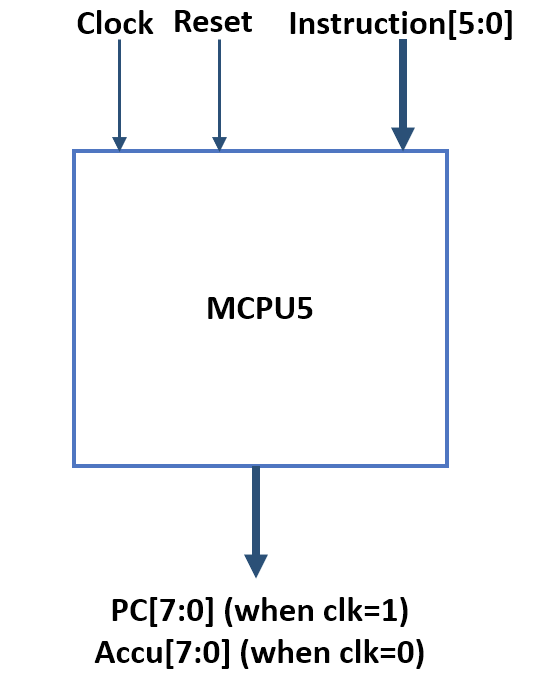
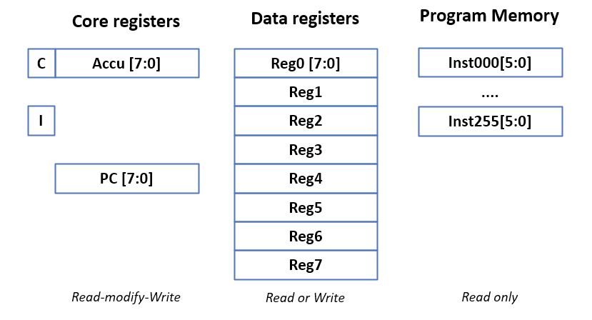
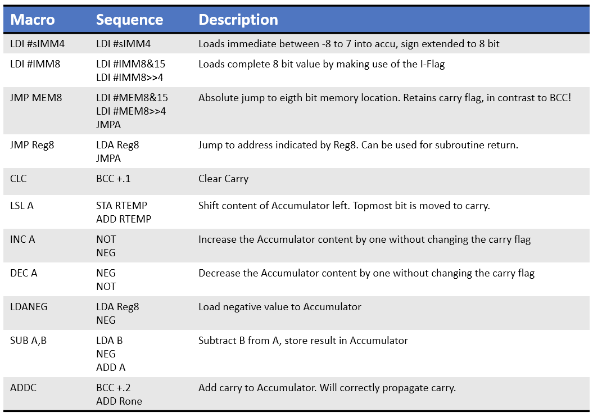
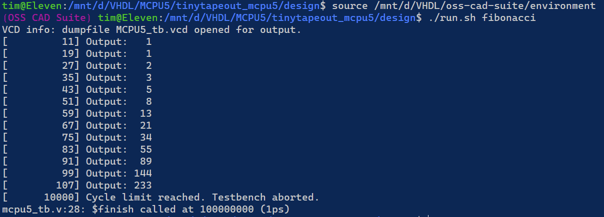
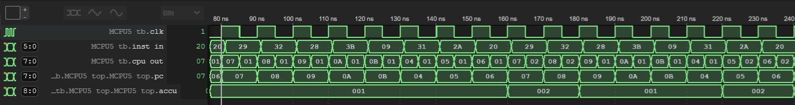
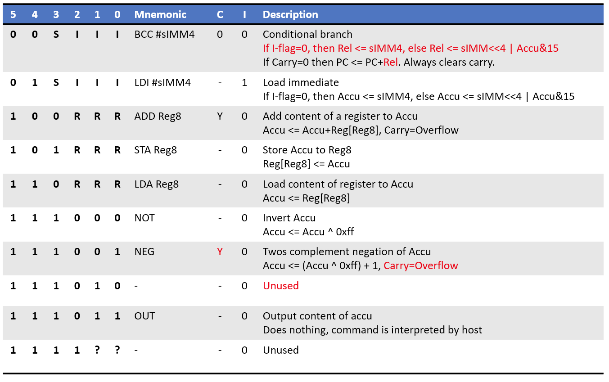
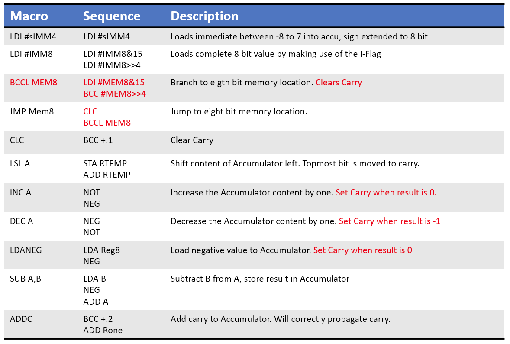
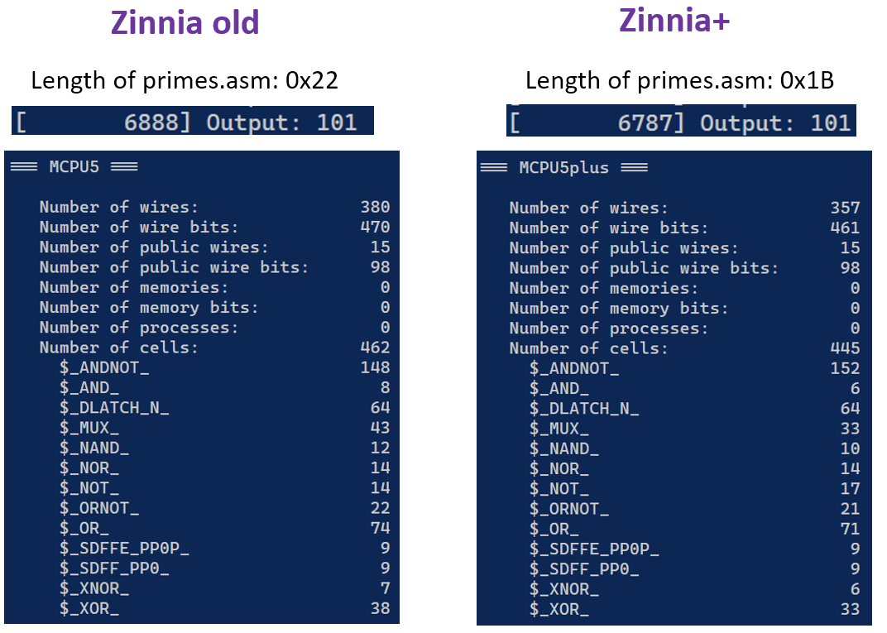
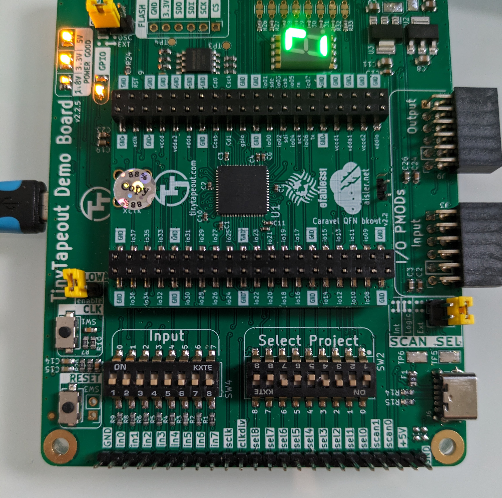
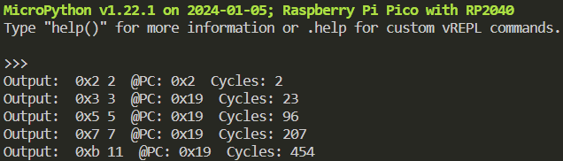

+++
title = "Zinnia (MCPU5)"
summary = "8 Bit CPU implemented in 100x100um^2 IC area for TinyTapeout"
date = "2022-09-06T00:00:00"
draft = false
hackaday_url = "https://hackaday.io/project/187192-zinnia-mcpu5"
featured = "featured.jpg"
showHero = true
heroStyle = "background"
layoutBackgroundBlur = false
+++
*8 Bit CPU implemented in 100x100um^2 IC area for TinyTapeout*

## Details

An 8 bit RISC CPU for [TinyTapeout](https://www.tinytapeout.com). Tinytapeout combines 500 designs on a single IC to be taped out with the Open MPW-7. This offers the opportunity to actually get a design made on a real IC, but also comes with some constraints:

- Maximum allowed area is 100 x 100 um^2 (=0.01 mm^2) in Skywater 130nm CMOS technology. The actual number of useable gates depends on cell size and routing limitations.
- Only eight digital inputs and eight digital outputs are allowed.
- I/O will be provided via the scanchain (a long shift register) and is hence rather slow.

Designing a CPU around these constraints offers a nice challenge. Challenge accepted!

## Project Logs
### 1) Design Description
<small>2022-09-06 20:32</small>

##### Top level

The strict limitations on I/O do not allow implementing a normal interface with bidirectional data bus and separate address bus. One way of addressing this would be to reduce the data width of the CPU to 4 bit, but this was deemed to limiting. Another option, implementing a serial interface, appeared too slow and too complex.

Instead the I/Os were allocated as shown below.

[](https://user-images.githubusercontent.com/4086406/188716014-33053217-c1a6-4cac-afc2-257b7203d407.png)

The CPU is based on the Harvard Architecture with separate data and program memories. The data memory is completely internal to the CPU. The program memory is external and is accessed through the I/O. All data has to be loaded as constants through machine code instructions.

Two of the input pins are used for clock and reset, the remaining ones are reserved for instructions and are six bit in length. The output is multiplexed between the program counter (when clk is '1') and the content of the main register, the Accumulator. Accessing the Accumulator allows reading the program output.

##### 

##### Programmers Model

[](https://user-images.githubusercontent.com/4086406/188716065-a4d7755b-9020-4291-94e4-f22cf04bb168.png)

Besides simplifying the external interface, the Harvard Architecture implementation also removes the requirement to interleave code and data access on the bus. Every instruction can be executed in a single clock cycle. Due to this, no state machine for micro-sequencing is required and instructions can be decoded directly from the inst[5:0] input.

All data operations are performed on the accumulator. In addition, there are eight data registers. The data registers are implemented as a single port memory based on latches, which significantly reduced are usage compared to a two port implementation. The Accu is complemented by a single carry flag, which can be used for conditional branches.

Handling of constants is supported by the integer flag (I-Flag"), which enables loading an eight bit constant with two consecutive 6 bit opcodes.

##### 

##### Instruction Set Architecture

The list of instructions and their encoding is shown below. One challenge in the instruction set design was to encode the target address for branches. The limited opcode size only allows for a four bit immediate to be encoded as a maximum. Initially, I considered introducing an additional segment register for long jumps, but ultimately decided to introduce relative addressing for conditional branches and a long jmp instruction that is fed from the accumulator.

Having both NOT and NEG may seems excessive, but the implementation was cheap on resources and some instruction sequences could be simplified.

No boolean logic instructions (AND/OR/NOT/NOR/XOR) are supported since they were not needed in any of my typical test programs.

[](https://user-images.githubusercontent.com/4086406/188716202-d0681200-9578-414f-8c06-417b6ae8950d.png)

The table below shows common instruction sequences that can be realized with macros.

[](https://user-images.githubusercontent.com/4086406/188716303-d0428667-788e-4f98-bd4b-40d5c7e23e4d.png)

### 2) Testbench and Assembler
<small>2022-09-07 16:34</small>

You can find the cleaned up designfiles including testbench and assembler on [Github](https://github.com/cpldcpu/tinytapeout_mcpu5/tree/main/design).

I ported two program examples from my other processor designs: Fibonacci number calculation and a prime number search algorithm. 

Fibonacci examples seem to be quite commonplace for minimal processor implementations. However, Fibonacci can be implemented on a machine without any decision making (branching). So, proving that an architecture is able to execute Fibonacci is possibly not a proof of Turing completeness. This is why I prefer the prime number search.

The Fibonacci implementation is straightforward and shown below:

```html
.=0
init:
    LDI  0
    STA  R0  ; a = 0
    LDI  1
    STA  R1  ; b = 1
loop:
    LDA  R1
    STA  R2  ; temp = b

    ADD  R0
    STA  R1  ; b' = a + b

    LDA  R2
    STA  R0  ; a = b

    OUT      ; display b

    BCC loop
idle:
    BCC idle

```

The testbench will show the output of the executed programs directly in the shell. In addition, a VCD file with waveforms is generated, which can be viewed with GTKWAVE or the [WaveTrace plugin](https://www.wavetrace.io/) in VSCode.

[](https://user-images.githubusercontent.com/4086406/188920501-4257ff7e-d6df-495d-963a-cf1aee4d25f1.png)

The number in brackets shows the number of executed program cycles, the output shows the content of the accumulator when the "OUT" instruction in the machine code is executed.

[](https://user-images.githubusercontent.com/4086406/188921127-461e2d08-ba10-4bcb-b11b-6f22f69dc238.png)Prime number sieve:

```cpp
;    divisor=2;    
;    while (divisor<number)
;    {
;        test=-number;
;        while (test<0) test+=divisor;
;        if (test==0) return 0;
;        divisor+=1;
;    }
;    return 1;

number     = R0
divisor    = R1
allone     = R7

.=0
start:
    LDI -1
    STA allone

    LDI 2
    STA number

    OUT                 ; first prime is 2

outerloop:
    LDI 2
    STA divisor            ;divisor = 2

    LDI 1
    ADD number
    STA number
loop:
    LDA number          ; test=-number;
    NEG
innerloop:
    ADD    divisor            ; while (test<0) test+=divisor;
    BCCL innerloop

    ADD    allone           ; if (test==0) return 0;
    BCCL outerloop       ; No prime

    LDI 1               ; divisor+=1;
    ADD    divisor
    STA    divisor

    NEG                 ; while (divisor<number)
    ADD number
    BCCL loop

prime:
    LDA number          ; Display prime number
    OUT

    JMP outerloop

```

### 3) Improved Instruction Set Architecture: Zinnia+
<small>2022-09-07 19:56</small>

Post-Tapeout-Regret version: When I implemented the primes example code I noticed some shortcomings of the instructions set architecture that could be easily fixed. The updated version is [here on Github](https://github.com/cpldcpu/tinytapeout_mcpu5/tree/main/design_plus), but unfortunatly did not make it on the chip.

##### Changes

Three changes have been introduced:

1. Allowing the `NEG` instruction to upgrade the carry. This allows for an easy test for accu=0 or overflow during `INC`/`DEC` macros.
2. Modifying the `BCC` instruction to read part of the branch target address from the accu, if the iflag is set. This allows for much easier implementation of 8 bit branch target addresses.
3. Removing `JMPA` as it was deemed unnecessary with the modification above.

The resulting instruction set design reduces code size, improves execution speed and even reduces the number of macrocells in the design. A clear win-win.

##### 

##### Updated Instruction set

Changes highlighted in red
[](https://user-images.githubusercontent.com/4086406/188964781-6225424b-dbec-4612-abec-af46d9475376.png)

##### 

##### Macros using updated instruction set

[](https://user-images.githubusercontent.com/4086406/188964855-a3e7898a-a654-4cfc-b8fc-e3d9afdaa0ac.png)

##### 

##### Benchmark of normal vs. plus version

[](https://user-images.githubusercontent.com/4086406/188964934-6237c9f9-7317-45d7-9a42-db6cfef9d972.png)

### 4) Testing of the actual ASIC
<small>2024-02-21 21:34</small>

I finally received the TinyTapeout board with the Zinnia+ MCU design!



I decided to use an RP2040 the exercise the I/O of the design. Since the code memory is external to the MCU, it needs to be emulated by a program on the RP2040.

Here is the output of the prime number generation program:


More documentation and code here: [https://github.com/cpldcpu/tt02-mcpu5plus/tree/main/validation](https://github.com/cpldcpu/tt02-mcpu5plus/tree/main/validation)

> Exported from Hackaday.io [Zinnia (MCPU5)](https://hackaday.io/project/187192-zinnia-mcpu5)
